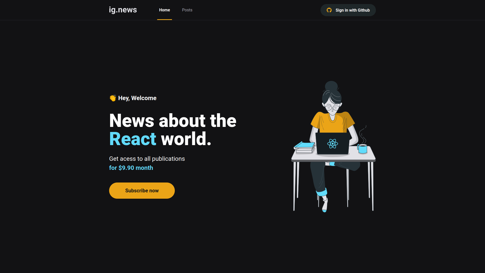
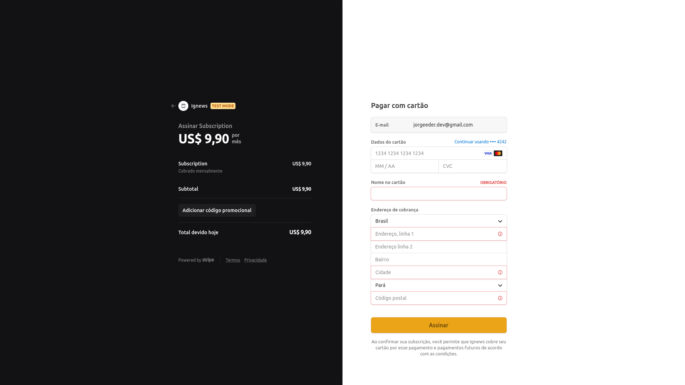
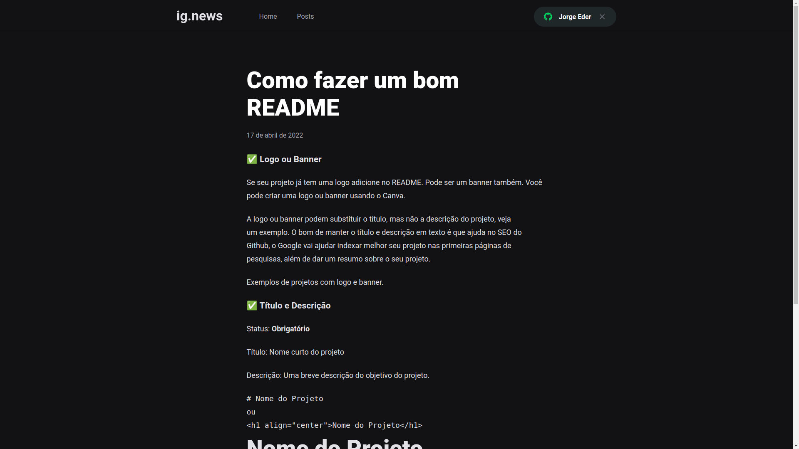

<div>
  <h1 align="center"> 
  Ig.news
  </h1>
  <h2 align="center"> 
  Next.js Fundamentals
  </h2>
  <h3 align="center"> 
  Module 3 - RocketSeat - Ignite ReactJS 🔥
  </h3>

  <p align="center">
    <a href="https://rocketseat.com.br">
      
    </a>
    <a href="https://github.com/jorgeeder"> 
      
    </a>
    
    
    <a href="https://opensource.org/licenses/MIT">
      
    </a>
  </p>
</div>

## About The Project

The ig.news project is a blog where users can access the content of each post according to their subscription status.
The blog has a purchase system integrated with STRIPE, and after the user makes the payment, their subscription will be active and ready to view the full content of the entire blog. If the user does not wish to opt for the subscription, he will have limited access to the content of the posts. And all the data needed to verify signatures or user data are saved in the FaunaDB database.

This is a Serverless application, that is, the entire process that would depend on a backend was integrated within the front end and following the JAMStack standard.
Posts are made through the Prismic CMS panel and integrated directly from the front.

## Features

- Authentication with github
- Show page content according to permission level
- Application subscription
- Payments with stripe
- User record in the Fauna database
- Content management with prismic CMS


## Technologies

-   **[Next.js](https://nextjs.org/)**
-   **[Stripe](https://stripe.com/docs)**
-   **[FaunaDB](https://fauna.com/)**
-   **[Prismic CMS](https://prismic.io/)**
-   **[Github Oauth](https://docs.github.com/en/developers/apps/building-oauth-apps/authorizing-oauth-apps)**

## Application in Use

 
 
 
 

## Requirements

Necessary to carry out the installations:
-   **[Node.js](https://nodejs.org/)**
-   **[Git](https://git-scm.com/)**
-   **[Yarn](https://classic.yarnpkg.com)**
-   **[Stripe CLI](https://stripe.com/docs/stripe-cli)**

Create account and configure external services:

-   **[Stripe](https://stripe.com/)**
-   **[FaunaDB](https://fauna.com/)**
-   **[Prismic CMS](https://prismic.io/)**

## Running The Project
First, run the development server:
```bash
npm run dev
# or
yarn dev

```
Open [http://localhost:3000](http://localhost:3000) with your browser to see the result.

## License

This project is under the MIT license. See the [LICENSE](/LICENSE) file for more details.


<div align="center">
  <p> Made with 💜 by <a href="https://github.com/jorgeeder">Jorge Eder</a> </p>
  <p>
    <a href="https://www.linkedin.com/in/jorgeeder/">
      
    </a>
    <a href = "mailto:jorgeeder.dev@gmail.com">
      
    </a>
  </p>
</div>